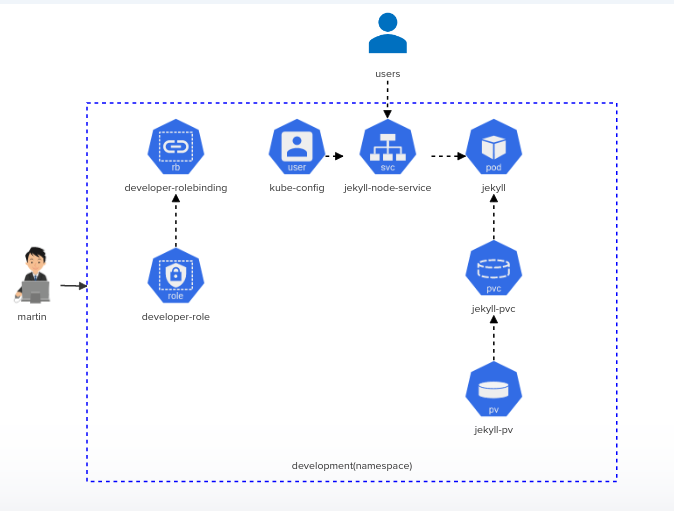

# Kodekloud Kubernetes Challenges

This repository contains the solution for kubernetes challenge series from Kodekloud.

## Challenges

Following challenges can be found within this repository:

1. **Challenge-01**: Deploy Jekyll SSG 
    - **_Description_**: Deploy the given architecture diagram for implementing a Jekyll SSG
   
    - **_Architecture Diagram_**
      
        

    - **_Solution_**: Solution for this first can be found at the kubernetes-challenge-01 folder

2. **Challenge-02**: Troubleshooting and Deploying Objects
    - **_Description_**: Troubleshooting and fixing a broken master node within Kubernetes cluster and deploying objects based on the given architecture diagram.
   
    - **_Architecture Diagram_**:
      
        
 
    - **_Solution_**: Solution for this first can be found at the kubernetes-challenge-02 folder
  
     
3. **Challenge-03**: Voting Application
    - **_Description_**: Deploying the Voting Application on a Kubernetes cluster.
      
    - **_Architecture Diagram_**:
      
        
    
     - **_Solution_**: Solution for this first can be found at the kubernetes-challenge-03 folder

    
4. **Challenge-04**: Provision Redis Cluster
    - **_Description_**: Build a highly available Redis cluster.
      
    - **_Architecture Diagram_**:
      
        

   - **_Solution_**: Solution for this first can be found at the kubernetes-challenge-04 folder
