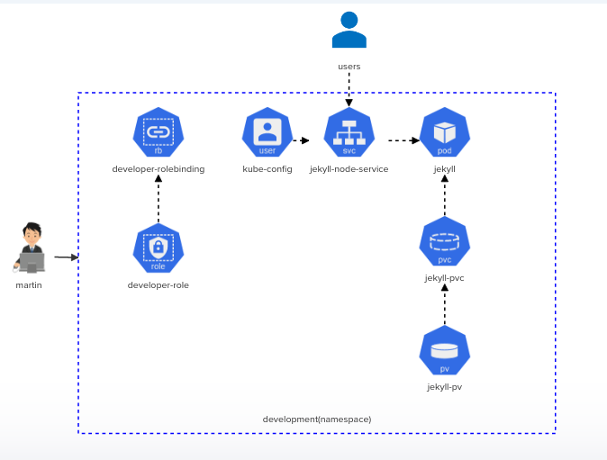

# Challenge-01:

  Deploy the given architecture diagram for implementing a Jekyll SSG.

  
  
# 1. Jekyll-site PV: 
  Physical Volume is already created. Inspect it before creating the physical volume claim.

# 2. Create Physical Volume Claim: 
<details>
<summary>jekyll-pvc</summary>

 Access the yaml file for physical volume claim [Here](./jekyll-pvc.yaml)
</details>

# 3. Create Kubernetes Resource Pod:
<details>
<summary>jekyll</summary>

Access the yaml file for kubernetes resource Pod [Here](./jekyll-pod.yaml)

The pod will take at least 30 seconds to initialize.

</details>

# 4.Create Kubernetes Node Service:
<details>
<summary>jekyll-node-service</summary>

Access the yaml file for kubernetes resource Node [Here](./jekyll-node-service.yaml)
</details>

# 5.Create Developer-role: 
<details>
<summary>developer-role</summary>
</br>
  
```
 kubectl create role developer-role --resource=pods,svc,pvc --verb="*" -n development

```
</br>--- OR ---</br></br>Access Yaml file to create role [Here](./developer-role.yaml)
</details>

# 6.Create Developer-rolebinding:
<details>
<summary>developer-rolebinding</summary>
</br>
  
```
    # Apply the following CLI command to create rolebinding
    kubectl create rolebinding developer-rolebinding --role=developer-role --user=martin -n development
    # Apply the following CLI command to manifest Yaml file for developer-rolebinding
    kubectl create rolebinding developer-rolebinding --role=developer-role --user=martin -n development --dry-run=client -o yaml > rolebinding.yaml
```
</br>--- OR ---</br></br>Access the yaml file for kubernetes rolebinding [Here](./developer-rolebinding.yaml)
</details>

# 7.Implement Set Context:
<details>
<summary>kube-config</summary>

```bash
    kubectl config set-credentials martin --client-certificate ./martin.crt --client-key ./martin.key
    kubectl config set-context developer --cluster kubernetes --user martin
```
</details>

# 8.Implement Use Context
<details>
<summary>context</summary>

```bash
    kubectl config use-context developer
```
</details>
