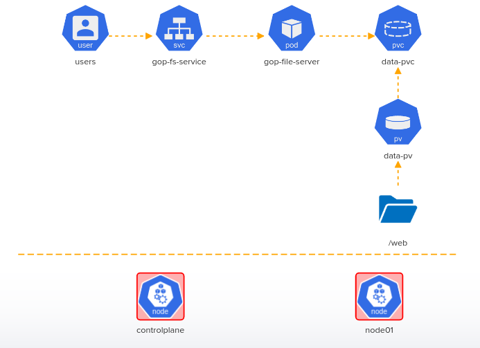

# Challenge-02: 

This 2-Node Kubernetes cluster is broken! Troubleshoot, fix the cluster issues and then deploy the objects according to the given architecture diagram to unlock our Image Gallery!!

# 1. Troubleshoot master/controlplane node within Kubernetes Cluster
- kubeconfig = /root/.kube/config, User = 'kubernetes-admin' Cluster: Server Port = '6443
- Fix kube-apiserver. Make sure its running and healthy.
- Master node: coredns deployment has image: 'k8s.gcr.io/coredns/coredns:v1.8.6

# 2. Perform Node Health Check
- Test if node01 is ready and can schedule pods?

# 3. Transfer Files 
- Copy all images from the directory '/media' on the controlplane node to '/web' directory on node01

# 4. Implement PV
- Create new PersistentVolume = 'data-pv'
- PersistentVolume = data-pv, accessModes = 'ReadWriteMany'
- PersistentVolume = data-pv, hostPath = '/web'
- PersistentVolume = data-pv, storage = '1Gi'

# 5. Implement PVC
- Create new PersistentVolumeClaim = 'data-pvc'
- PersistentVolume = 'data-pvc', accessModes = 'ReadWriteMany'
- PersistentVolume = 'data-pvc', storage request = '1Gi'
- PersistentVolume = 'data-pvc', volumeName = 'data-pv'

# 6. Implement POD
- Create a pod for fileserver, name: 'gop-fileserver'
- pod: gop-fileserver image: 'kodekloud/fileserver'
- pod: gop-fileserver mountPath: '/web'
- pod: gop-fileserver volumeMount name: 'data-store'
- pod: gop-fileserver persistent volume name: data-store
- pod: gop-fileserver persistent volume claim used: 'data-pvc'

# 7. Implement Service
- New Service, name: 'gop-fs-service'
- Service name: gop-fs-service, port: '8080'
- Service name: gop-fs-service, targetPort: '8080'
