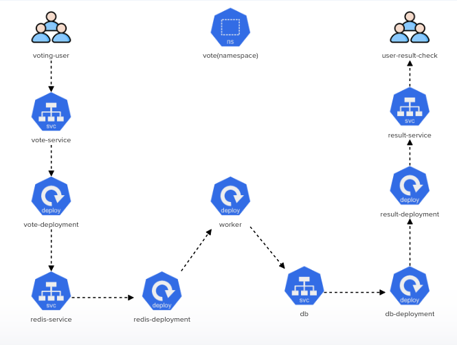

# Challenge-03: 
  
  Deploy the given architecture Within vote namespace to deploy voting application.

  
  
# 1. Create First Service: 
    - name = vote-service
    - port = '5000'
    - targetPort = '80'
    - nodePort= '31000'
    - service endpoint exposes deployment 'vote-deployment'

# 2. Create First Deployment:
    - name = 'vote-deployment'
    - image = 'kodekloud/examplevotingapp_vote:before'
    - status: 'Running'

# 3. Create Second Service:
    - name = 'redis'
    - port: '6379'
    - targetPort: '6379'
    - type: 'ClusterIP'
    - service endpoint exposes deployment 'redis-deployment'

# 4. Create Second Deployment:
     - name: 'redis-deployment'
     - image: 'redis:alpine'
     - Volume Type: 'EmptyDir'
     - Volume Name: 'redis-data'
     - mountPath: '/data'
     - status: 'Running'

# 5. Create Third Deployment: 
     - name: 'worker'
     - image: 'kodekloud/examplevotingapp_worker'
     - status: 'Running'

# 6. Create Third service: 
     - name: 'db'
     - port: '5432'
     - targetPort: '5432'
     - type: 'ClusterIP'

# 7. Create Fourth Deployment:
     - name: 'db-deployment'
     - image: 'postgres:9.4' and add the env: 'POSTGRES_HOST_AUTH_METHOD=trust'
     - Volume Type: 'EmptyDir'
     - Volume Name: 'db-data'
     - mountPath: '/var/lib/postgresql/data'
     - status: 'Running'

# 8. Create Fifth Deployment: 
    - name: 'result-deployment'
    - image: 'kodekloud/examplevotingapp_result:before'
    - status: 'Running'

# 9. Create Fourth Service: 
    - name: 'result-service'
    - port: '5001'
    - targetPort: '80'
    - NodePort: '31001
