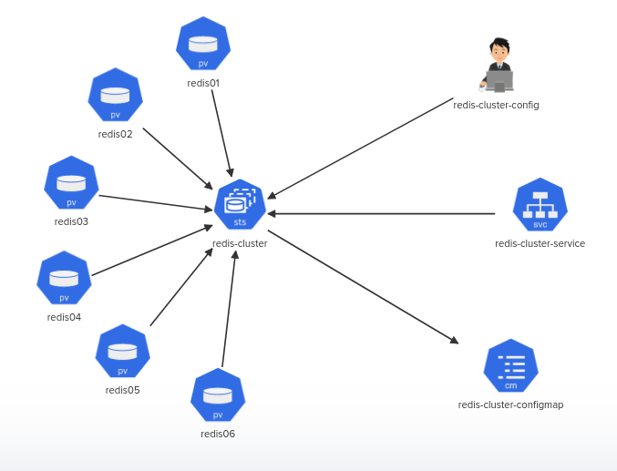

# Challenge-04:

  Build a highly available Redis Cluster based on the given architecture diagram.

  

# 1.Create First PersistentVolume: 
- Name: redis01
- Access modes: ReadWriteOnce
- Size: 1Gi
- hostPath: /redis01, directory should be created on worker node

# 2.Create Second PersistentVolume: 
- Name: redis02
- Access modes: ReadWriteOnce
- Size: 1Gi
- hostPath: /redis02, directory should be created on worker node

# 3.Create Third PersistentVolume: 
- Name: redis03
- Access modes: ReadWriteOnce
- Size: 1Gi
- hostPath: /redis03, directory should be created on worker node

# 4.Create Fourth PersistentVolume: 
- Name: redis04
- Access modes: ReadWriteOnce
- Size: 1Gi
- hostPath: /redis04, directory should be created on worker node

# 5.Create Fifth PersistentVolume:
- Name: redis05
- Access modes: ReadWriteOnce
- Size: 1Gi
- hostPath: /redis05, directory should be created on worker node

# 6.Create Sixth PersistentVolume: 
- Name: redis06
- Access modes: ReadWriteOnce
- Size: 1Gi
- hostPath: /redis06, directory should be created on worker node

# 7.Create StatefulSet 
- Name: redis-cluster
- Replicas: 6
- Pods status: Running (All 6 replicas)
- Image: redis:5.0.1-alpine, Label = app: redis-cluster
- container name: redis, command: ["/conf/update-node.sh", "redis-server", "/conf/redis.conf"]
- Env: name: 'POD_IP', valueFrom: 'fieldRef', fieldPath: 'status.podIP' (apiVersion: v1)
- Ports - name: 'client', containerPort: '6379'
- Ports - name: 'gossip', containerPort: '16379'
- Volume Mount - name: 'conf', mountPath: '/conf', readOnly:'false' (ConfigMap Mount)
- Volume Mount - name: 'data', mountPath: '/data', readOnly:'false' (volumeClaim)
- volumes - name: 'conf', Type: 'ConfigMap', ConfigMap Name: 'redis-cluster-configmap',
- Volumes - name: 'conf', ConfigMap Name: 'redis-cluster-configmap', defaultMode = '0755'
- VolumeClaimTemplates - name: 'data'
- VolumeClaimTemplates - accessModes: 'ReadWriteOnce'
- VolumeClaimTemplates - Storage Request: '1Gi'

# 8.ConfigMap: 
- redis-cluster-configmap is already created. Inspect it…

# 9.Create service: 
- name  redis-cluster-service
- Ports - service name 'redis-cluster-service', port name: 'client', port: '6379'
- Ports - service name 'redis-cluster-service', port name: 'gossip', port: '16379'
- Ports - service name 'redis-cluster-service', port name: 'client', targetPort: '6379'
- Ports - service name 'redis-cluster-service', port name: 'gossip', targetPort: '16379'

# 10.Create redis-cluster-config
- Command: kubectl exec -it redis-cluster-0 -- redis-cli --cluster create --cluster-replicas 1 $(kubectl get pods -l app=redis-cluster -o jsonpath='{range.items[*]}{.status.podIP}:6379 {end}')
