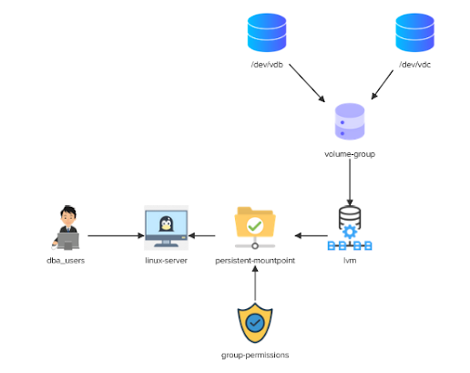

# Linux Challenge-01


The database server called centos-host is running short on space! You have been asked to add an LVM volume for the Database team using some of the existing disks on this server.Below is the 
architecture diagram:



Run all the command being root user. Do the following

```bash
sudo su -
```

#  Solution Steps

### Group creation and addition of existing user 

<details>
<summary>Create a group called "dba_users" and add the user called 'bob' to this group</summary>

```bash
groupadd dba_users
```
</details>

<details>
<summary>Add bob to group</summary>

```bash
usermod -G dba_users bob
```
</details>

### Linux Server

Install the correct packages that will allow the use of "lvm" on the centos machine.

Discover what correct logical volume manager package need to to be installed, then run the foloowing:

<details>
<summary>Install package</summary>

```bash
yum install -y lvm2
```
</details>

### Physical Volume for block device /dev/vdb

<details>
<summary>Create a Physical Volume for "/dev/vdb"</summary>

```bash
pvcreate /dev/vdb
```
</details>

### Physical Volume for block device /dev/vdc

<details>
<summary>Create a Physical Volume for "/dev/vdc"</summary>

```bash
pvcreate /dev/vdc
```
</details>

### Creation of volume-group dba_storage

<details>
<summary>Create a volume group called "dba_storage" using the physical volumes "/dev/vdb" and "/dev/vdc"</summary>

```bash
vgcreate dba_storage /dev/vdb /dev/vdc
```
</details>

### Creation of logical volume with volume group dba_storage

<details>
<summary>Create an "lvm" called "volume_1" from the volume group called "dba_storage". Make use of the entire space available in the volume group.</summary>

```bash
lvcreate -l +100%FREE -n volume_1 dba_storage
```
</details>

### Formatting Logical Volume 

<details>
<summary>Format the lvm volume "volume_1" as an "XFS" filesystem</summary>

```bash
mkfs.xfs /dev/mapper/dba_storage-volume_1
```
</details>

<details>
<summary>Create new directory /mnt/dba_storage and mount the filesystem at that path.</summary>

```bash
mkdir -p /mnt/dba_storage
mount /dev/mapper/dba_storage-volume_1 /mnt/dba_storage
```
</details>

<details>
<summary>Format file system table to make sure that this mount point is persistent across reboots with the correct default options.</summary>

```bash
vi /etc/fstab
```
Add the following line within the fstab and save it.

```
/dev/mapper/dba_storage-volume_1 /mnt/dba_storage xfs defaults 0 0
```
</details>

### Update Group Permission

<details>
<summary>Ensure that the mountpoint "/mnt/dba_storage" has the group ownership set to the "dba_users" group</summary>

```bash
chown :dba_users /mnt/dba_storage
```
</details>

<details>
<summary>Ensure that the mount point "/mnt/dba_storage" has "read/write" and execute permissions for the owner and group and no permissions for anyone else.</summary>

```bash
chmod 770 /mnt/dba_storage
```
</details>
