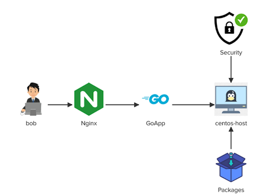

# Linux Challenge-02

The app server called centos-host is running a Go app on the 8081 port. We have been asked to perform following:
- Troubleshoot some issues with package manager yum/dnf on centos-host
- Install Nginx server and configure Nginx as a reverse proxy for Go app
- Install firewalld package and then configure some firewall rules

Follow the architecture diagram for more clarity:



Run all the command with root user privilege. Do the following:

```bash
sudo su -
```
# Detailed Solution Script

### DNS Resolution

Since package manager dnf/yum not able to install a required packages we need to check and trobleshoot resolv.conf configuration file as nameserver is missing.

<details>
<summary>Configure resolv.conf file for DNS resolution</summary>

```bash
vi /etc/resolv.conf
```

Add Google nameserver as the first line in the file and save

```
nameserver 8.8.8.8
```

</details>

### Install Required Packages

<details>
<summary>Install required package as instructed in task</summary>

```bash
dnf install -y nginx firewalld
```
</details>

### Run Firewalld

<details>
<summary>Start and Enable firewalld service.</summary>

```bash
systemctl start firewalld && systemctl enable firewalld
```
</details>

Add firewall rules to allow incoming traffic for ports 22, 80 and 8081

<details>
<summary>Add firewall rules, make permanent and effective.</summary>

```bash
firewall-cmd --zone=public --add-port=22/tcp --permanent
firewall-cmd --zone=public --add-port=80/tcp --permanent
firewall-cmd --zone=public --add-port=8081/tcp --permanent
firewall-cmd --reload
```
</details>

### Run Go Application in the background

<details>
<summary>Run Go App</summary>

```bash
nohup go run ~/go-app/main.go &
```
</details>

### Set Nginx As Reserve Proxy

<details>
<summary>Configure Nginx as a reverse proxy for the GoApp and access at port 80 instead of 8081</summary>

```bash
vi /etc/nginx/nginx.conf
```

At line 48 insert the following line after `location / {`

```
            proxy_pass  http://localhost:8081;
```
</details>

<details>
<summary>Start and Enable nginx service</summary>

```bash
systemctl start nginx && systemctl enable nginx
```
</details>

