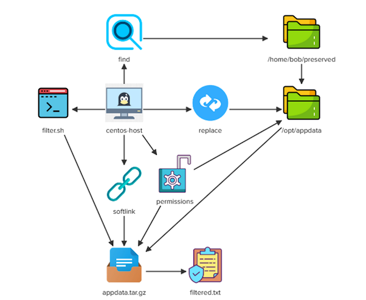

# Linux Challenge-04

Some of our apps generate some raw data and store the same in /home/bob/preserved directory. For this challenge do the following:
- Clean and manipulate some data
- Create an archive of that data.

Architecture Diagram:



Run all task with root user privilege. Do the following:

```bash
sudo su -
```

# Solution Script

### Discover and Transfer Hidden And Non-Hidden Files

<details>
<summary>Find the "hidden" files in "/home/bob/preserved" directory and copy them in "/opt/appdata/hidden/" directory.</summary>

```bash
mkdir -p /opt/appdata/hidden
find /home/bob/preserved -type f -name ".*" -exec cp "{}" /opt/appdata/hidden/ \;
```

</details>

<details>
<summary>Find the "non-hidden" files in "/home/bob/preserved" directory and copy them in "/opt/appdata/files/" directory.</summary>

```bash
mkdir -p /opt/appdata/files
find /home/bob/preserved -type f -not -name ".*" -exec cp "{}" /opt/appdata/files/ \;
```

</details>

<details>
<summary>Find and delete the files in "/opt/appdata" directory that contain a word ending with the letter "t" (case sensitive).</summary>

```bash
rm -f $(find /opt/appdata/ -type f -exec grep -l 't\>' "{}"  \; )
```

</details>

### Find And Replace Words From Files 

<details>
<summary>Change all the occurrences of the word "yes" to "no" in all files present under "/opt/appdata/" directory.</summary>

```bash
find /opt/appdata -type f -name "*" -exec sed -i 's/\byes\b/no/g' "{}" \;
```

</details>

<details>
<summary>Change all the occurrences of the word "raw" to "processed" in all files present under "/opt/appdata/" directory. It must be a "case-insensitive" replacement, means all words must be replaced like "raw , Raw , RAW" etc.</summary>

```bash
find /opt/appdata -type f -name "*" -exec sed -i 's/\braw\b/processed/ig' "{}" \;
```

</details>

### Create An Archive 

<details>
<summary>Create a "tar.gz" archive of "/opt/appdata" directory and save the archive to this file: "/opt/appdata.tar.gz"</summary>

```bash
cd /opt/
tar -czf appdata.tar.gz /opt/appdata 
```

</details>

### Change Ownership and Permissions

<details>
<summary>Add the "sticky bit" special permission on "/opt/appdata" directory.</summary>

```bash
chmod +t /opt/appdata
```
</details>

<details>
<summary>Make "bob" the "user" and the "group" owner of "/opt/appdata.tar.gz" file.</summary>

```bash
chown bob:bob /opt/appdata.tar.gz
```
</details>

<details>
<summary>The "user/group" owner should have "read only" permissions on "/opt/appdata.tar.gz" file and "others" should not have any permissions.</summary>

```bash
chmod 440 /opt/appdata.tar.gz
```
</details>

### SoftLink Creation

<details>
<summary>
Create a "softlink" called "/home/bob/appdata.tar.gz" of "/opt/appdata.tar.gz" file.</summary>

```bash
ln -s /opt/appdata.tar.gz /home/bob/appdata.tar.gz
```
</details>

### Create Script File

<details>
<summary>Create a script called "/home/bob/filter.sh".<br>The script should filter the lines from "/opt/appdata.tar.gz" file which contain the word "processed", and save the filtered output in "/home/bob/filtered.txt" file.</summary>

```bash
vi /home/bob/filter.sh
```
Add the following lines and save it.

```bash
#!/bin/bash

tar -xzOf /opt/appdata.tar.gz | grep processed > /home/bob/filtered.txt
```

Make executable, and run it

```bash
chmod +x /home/bob/filter.sh
/home/bob/filter.sh
```
</details>
