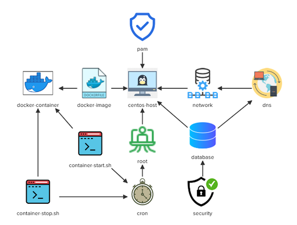

# Linux Challenge-05

For this challenge perform tasks regarding:
- Database Installation
- Network Configuration for database server
- Password setup for database root user
- Pull ngix image and run container for that image
- Create script file to start and stop container
- Create cronjob to automate running script file
- Configure Pam configuration file for 'su' utility

Architecture Diagram:



Run all tasks with root user privilege. Do the following

```bash
sudo su -
```

### DataBase Installation

<details>
<summary>Install "mariadb" database server on this centos-os machine and "start/enable" its service.</summary>

```bash
dnf install -y mariadb-server*
systemctl start mariadb && systemctl enable mariadb
```
</details>

### Network Configuration

<details>
<summary>Add an extra IP to eth1 interface on this system: 10.0.0.50/24.</summary>

```bash
ip addr add 10.0.0.50/24 dev eth1
```
</details>

### Add DNS Entry

<details>
<summary>Add a local DNS entry for the database hostname "mydb.kodekloud.com" so that it can resolve to "10.0.0.50" IP address.</summary>

```bash
vi /etc/hosts
```
Add the following line and save
```
10.0.0.50    mydb.kodekloud.com
```
</details>

### Database Security

<details>
<summary>Set a password for mysql root user to "S3cure#321".</summary>

The mariadb package installs a utility `mysqladmin` which is the command to use to do this

```bash
mysqladmin -u root password 'S3cure#321'
```
</details>

### Unlock root account

<details>
<summary>The "root" account is currently locked on "centos-host", please unlock it.</summary>

```bash
usermod -U root
```
</details>

<details>
<summary>Make user "root" a member of "wheel" group.</summary>

```bash
usermod -G wheel root
```
</details>

### Create Docker Image

<details>
<summary>Pull "nginx" docker image.</summary>

```bash
docker pull nginx
```

</details>

### Run Docker Container

<details>
<summary>Create and run a new Docker container based on the "nginx" image. The container should be named as "myapp" and the port "80" on the host should be mapped to the port "80" on the container.</summary>
run 
Note use of `-d` to make the container run in the background.

```bash
docker run -d -p 80:80 --name myapp nginx
```
</details>

### Create Shell Script To Run Docker Container

<details>
<summary>Create a bash script called "container-start.sh" under "/home/bob/" which should be able to "start" the "myapp" container. It should also display a message "myapp container started!"</summary>

```bash
vi /home/bob/container-start.sh
```
Add and save the following

```bash
#!/usr/bin/bash
docker start myapp
echo "myapp container started!"
```
Make shell script executable

```bash
chmod +x /home/bob/container-start.sh
```
</details>

### Create Shell Script To Stop Docker Container

<details>
<summary>Create a bash script called "container-stop.sh" under "/home/bob/" which should be able to stop the "myapp" container. It should also display a message "myapp container stopped!"</summary>

```bash
vi /home/bob/container-stop.sh
```
Add and save the following

```bash
#!/usr/bin/env bash
docker stop myapp
echo "myapp container stopped!"
```
Make shell script executable

```bash
chmod +x /home/bob/container-stop.sh
```
</details>

### Automate Tasks Within Script File Using CronJob

<details>
<summary>Add a cron job for the "root" user which should run "container-stop.sh" script at "12am" everyday.<br>Add a cron job for the "root" user which should run "container-start.sh" script at "8am" everyday.</summary>

```bash
crontab -e
```
Add and save the following 

```
0 0 * * * /home/bob/container-stop.sh
0 8 * * * /home/bob/container-start.sh
```
</details>

### Edit PAM Configuration File For 'SU' Utility

<details>
<summary>Find and edit the PAM configuration file for the "su" utility so that this utility only accepts the requests from the users that are part of the "wheel" group and the requests from the users should be accepted immediately, without asking for any password.</summary>

```bash
find /etc/ -type f -name su
# After getting path for SU utility uncomment and save two lines beginning '#auth' which relate to the 'wheel' group within Pam configuration file using sed command
sed -i 's/#auth/auth/g' /etc/pam.d/su
```
</details>
