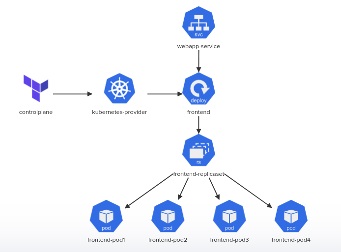

# Terraform Challenge-01:
In this challenge we will deploy several Kubernetes resources using terraform.
We will Utilize /root/terraform_challenge directory to store our Terraform configuration files.

Inspect the requirements in detail by clicking on the icons of the interactive architecture diagram on the right and complete the tasks.



# 1. Terraform Installation And Initialization: 
  <details>
  <summary>controlplane</br>Is Terraform version: 1.1.5 installed on controlplane?</summary>
  
  ```bash
    which terraform
  ```
  > Since terraform is not installed we must need to install it along with wget and unzip. Run the following

  ```bash
    apt update
    apt install -y wget unzip
    wget -q https://releases.hashicorp.com/terraform/1.1.5/terraform_1.1.5_linux_amd64.zip
    unzip terraform_1.1.5_linux_amd64.zip
    mv terraform /usr/local/bin/terraform
  ```
  </details>
    
# 2. Kubernetes Provider:
<details>
<summary>Kubernetes-Provider</br>Configure terraform and provider settings within provider.tf file</summary>
  
```bash
    cd /root/terraform_challenge
```
Access the terraform file to use hasicorp/kubernetes provider at [provider.tf](./kubernetes-provider.tf). This file has been configured and modified according to this task.
Now we can initialize the provider
```bash
    terraform init
```
</details>

# 3. Provision Kubernetes Deployment 
<details>
<summary>FrontEnd</br>Create a terraform resource frontend for kubernetes deployment</summary>
  
Access the terraform file which is created to provision resource frontend for kubernetes deployment at [frontend.tf](./kubernetes-deployment.tf). This file has been modified and include all specs as mentioned in task.
</details>

# 4. Provision Kubernetes Service
<details> 
<summary>WebApp-Service</br>Create a terraform resource webapp-service for kubernetes service</summary>
  
Access the terraform file which is created to provision resource webapp-service at [service.tf](./kubernetes-service.tf). This file has been modified and include all specs as mentioned in task.
</details>

# 5. Deploy Application
<details>
<summary>Deploy!</summary>
  
```bash
    terraform validate
    terraform plan
    terraform apply
```
</details>
  


