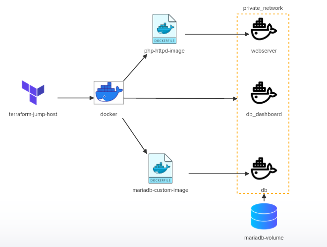

# Terraform Challenge-02:
In this challenge we will implement a simple LAMP stack using terraform and docker.
We will utilize /root/code/terraform-challenges/challenge2 directory to store our Terraform configuration files.

Inspect the requirements in detail by clicking on the icons of the interactive architecture diagram on the right and complete the tasks. 
Once done click on the Check button to validate your work.


# Solution Steps

# 1. Terraform Installation and Initialization
- Install terraform binary version=1.1.5 on iac-server
<details>
<summary>controlplane</br>Is Terraform version: 1.1.5 installed on controlplane?</summary>
  
```bash
    which terraform
```
> Since terraform is not installed we must need to install it along with wget and unzip. Run the following

```bash
    apt update
    apt install -y wget unzip
    wget -q https://releases.hashicorp.com/terraform/1.1.5/terraform_1.1.5_linux_amd64.zip
    unzip terraform_1.1.5_linux_amd64.zip
    mv terraform /usr/local/bin/terraform
```
</details>

# 2. Docker Provider Initialization
<details>
<summary>docker</br>Docker provider has already been configured using kreuzwerker/docker provider.</br>Check out the provider.tf given at /root/code/terraform-challenges/challenge2</summary>

```bash
    cd /root/code/terraform-challenges/challenge2
    cat provider.tf
```
    Run the following to initialize the provider.
```
    terraform init
```
Access docker provider file at [docker-provider.tf](./provider.tf)
</details>

# 3. Create A Terraform Resource For Docker Php-httpd Image
<details>
<summary>php-httpd-image</br>Create a terraform resource named php-httpd-image</summary>

Access docker image file at [php-httpd-image.tf](./php-httpd-image.tf)
</details>

# 4. Create A Terraform Resource Docker Database Image
<details>
<summary>mariadb-image</br>Create a terraform resource named mariadb-image</summary>

Access docker image file at [mariadb-custom-image.tf](./mariadb-custom-image.tf)
</details>

# 5. Create a Terraform Resource For Docker Private Network
<details>
<summary>private_network</br>Create a terraform resource named private_network</summary>

Access docker private network file at [docker-private-network.tf](./docker-private-network.tf)
</details>

# 6. Create a Terraform Resource For Docker Volume 
<details>
<summary>docker-volume</br>Create a terraform resource named docker-volume</summary>

Access docker volume file at [docker-volume.tf](./docker-volume.tf)
</details>

# 7. Create a Terraform Resource For Docker Php-httpd Container
<details>
<summary>php-httpd-container</br>Create a terraform resource named php-httpd-container</summary>

Access docker container file at [php-httpd-container.tf](./php-httpd-container.tf)
</details>

# 8. Create a Terraform Resource For Docker mariadb-custom Container
<details>
<summary>mariadb-custom-container</br>Create a terraform resource named mariadb-custom-container</summary>

Access docker container file at [mariadb-custom-container.tf](./mariadb-custom-container.tf)
</details>

# 9. Define a Terraform Resource For Docker mariadb-dashboard Container
<details>
<summary>mariadb-dashboard-container</br>Create a terraform resource named mariadb-dashboard-container</summary>

Access docker container file at [mariadb-dashboard-container.tf](./mariadb-dashboard-container.tf)
</details>

# Deploy the LAMP Stack
<details>
<summary>DEPLOY!</summary>
  
```bash
    terraform validate
    terraform plan
    terraform apply
```
</details>


