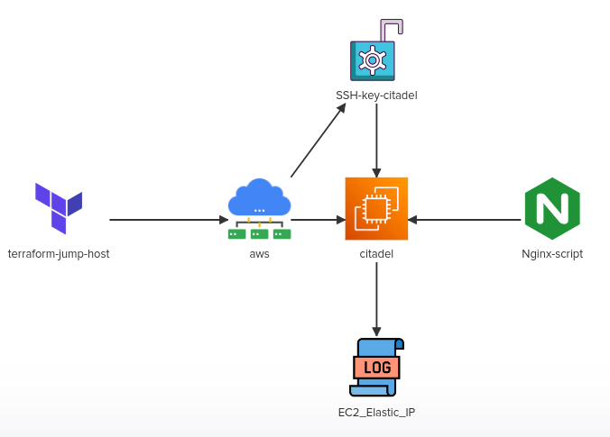

# Challenge-03

In this challenge we will implement a simple EC2 instance with some preinstalled packages. 
We will utilize /root/terraform-challenges/project-citadel directory to store our Terraform configuration files.
Inspect the requirements in detail by clicking on the icons of the interactive architecture diagram:

# Create a terraform key-pair citadel-key with key_name citadel.
- Upload the public key ec2-connect-key.pub to the resource.
- Use the file function to read the the public key at /root/terraform-challenges/project-citadel/.ssh

# Create ec2 instance called citadel with following specification 
- AMI: ami-06178cf087598769c, use variable named ami
- Region: eu-west-2, use variable named region
- Instance Type: m5.large, use variable named instance_type
- Install nginx on citadel instance, make use of the user_data argument.

# Create elastic ip address for ec2 instance
- attached this eip to the EC2 instance called citadel
- create local-exec provisioner for this resource and use it to print the attribute called public_dns to a file /root/citadel_public_dns.txt on the iac-server
